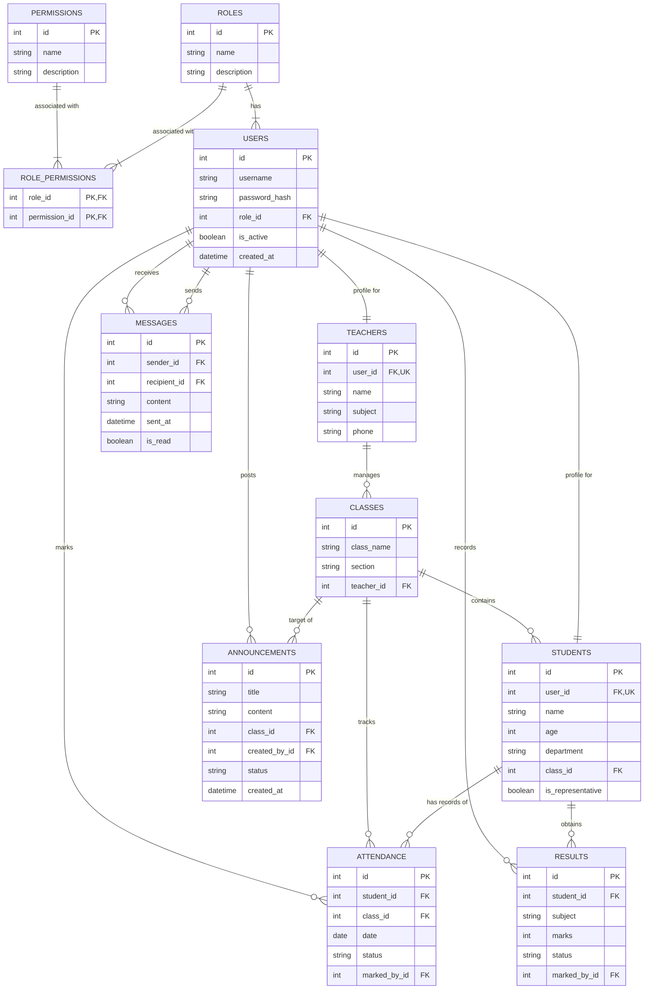

# Entity-Relationship (ER) Diagram

Below is the database schema for the school portal. This includes all 11 tables (including the user roles, permissions, academic data, attendance logs, results, announcements, and messages) and their corresponding relationships.

## Description of Relations

1. **Roles and Permissions**:
   - **`roles`** and **`permissions`** are linked via the **`role_permissions`** junction table, forming a many-to-many relationship mapping capabilities.
   - **`roles`** has a one-to-many relationship with **`users`** (every user has exactly one role).

2. **User Profiles**:
   - **`users`** has a one-to-one relationship with both **`teachers`** and **`students`**. A user profile can extend into a teacher or student record, with `user_id` acting as a unique key.

3. **Academic Structure**:
   - **`teachers`** has a one-to-many relationship with **`classes`** (each class can have one assigned class teacher).
   - **`classes`** has a one-to-many relationship with **`students`** (each student is registered in one class).

4. **Tracking & Logs**:
   - **`attendance`** joins **`students`**, **`classes`**, and the **`users`** who graded it.
   - **`results`** tracks exam marks for a **`student`**, graded by a specific **`user`** (staff).
   - **`announcements`** has a foreign key to **`classes`** (for class-specific board feeds) and **`users`** (the poster).
   - **`messages`** links sender and recipient user accounts (**`users`**) for direct communication records.
